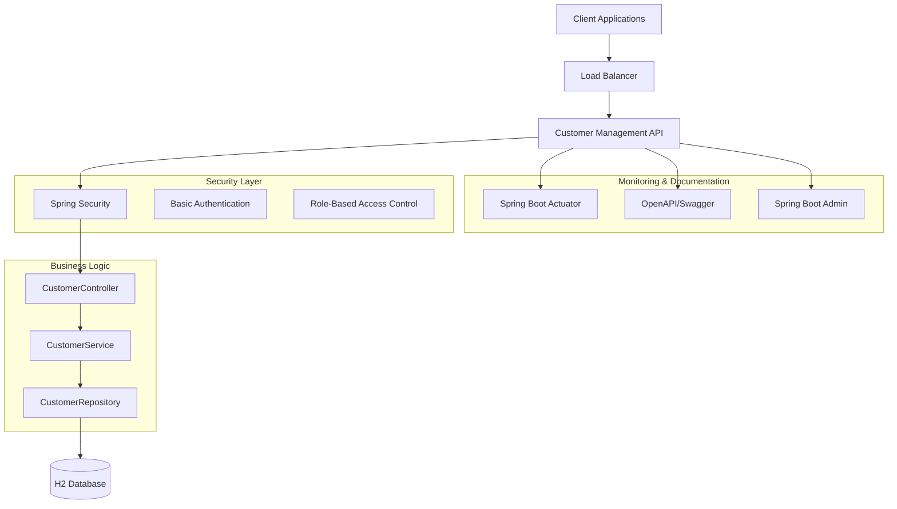
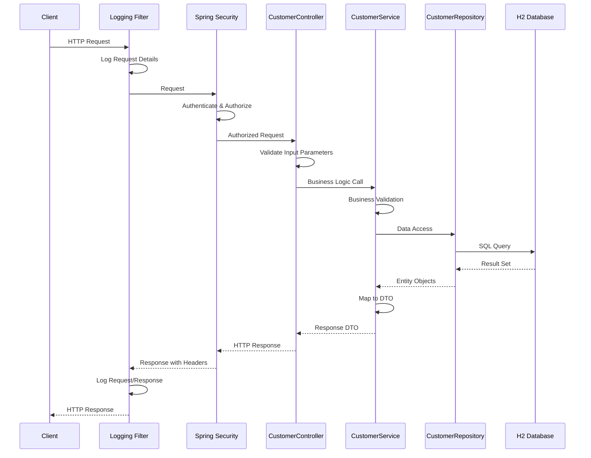
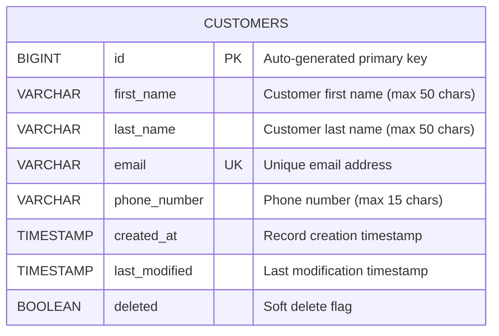
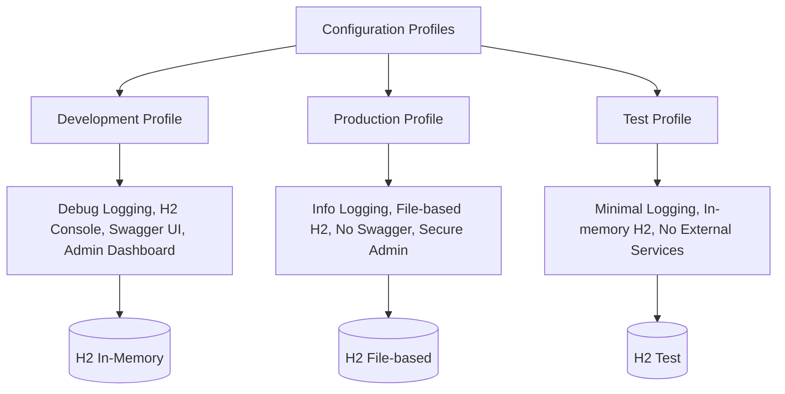
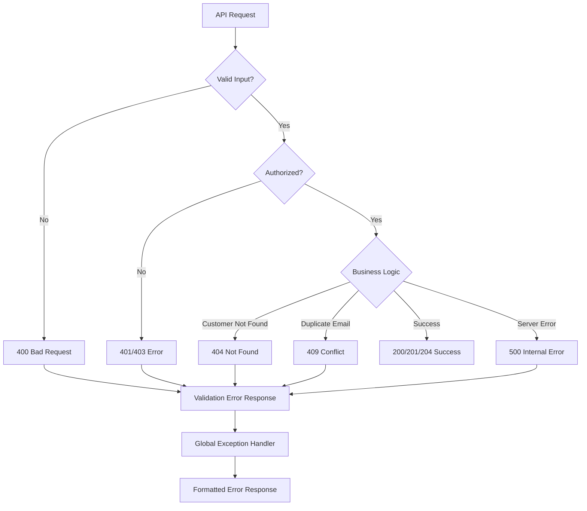
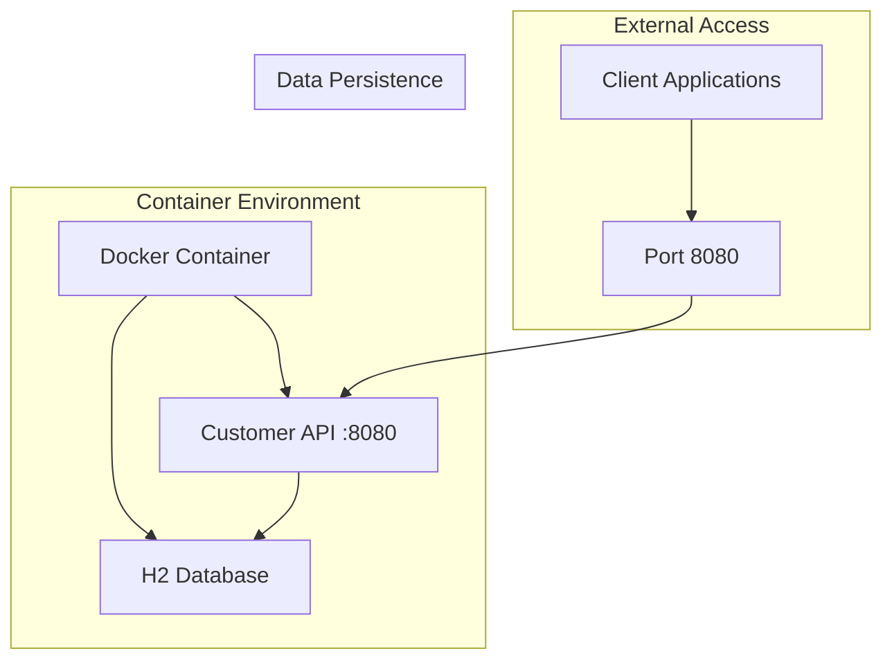

# Customer Management API Documentation

## Overview

The Customer Management API is a RESTful service built with Spring Boot 3.3.4 that provides CRUD operations for customer data management. It features security, validation, pagination, monitoring, and comprehensive documentation.

## Architecture Overview



## API Flow Diagram



## Database Schema



## Security Architecture

```mermaid
graph TD
    Request[HTTP Request] --> Auth{Authenticated?}
    Auth -->|No| Login[Basic Auth Login]
    Auth -->|Yes| Role{Check Role}
    Login --> Role
    
    Role -->|USER| ReadOnly[Read-Only Access]
    Role -->|ADMIN| FullAccess[Full CRUD Access]
    Role -->|NONE| Denied[Access Denied]
    
    ReadOnly --> GetCustomers[GET /api/v1/customers]
    ReadOnly --> GetCustomer[GET /api/v1/customers/{id}]
    
    FullAccess --> GetCustomers
    FullAccess --> GetCustomer
    FullAccess --> CreateCustomer[POST /api/v1/customers]
    FullAccess --> UpdateCustomer[PUT /api/v1/customers/{id}]
    FullAccess --> DeleteCustomer[DELETE /api/v1/customers/{id}]
    FullAccess --> AdminFeatures[Swagger UI, Admin Dashboard]
    
    Denied --> Error403[403 Forbidden]
```

## API Endpoints

### Customer Management

| Method | Endpoint | Description | Required Role | Request Body | Response |
|--------|----------|-------------|---------------|--------------|----------|
| GET | `/api/v1/customers` | Get paginated customers | USER, ADMIN | None | CustomerPageResponseDto |
| GET | `/api/v1/customers/{id}` | Get customer by ID | USER, ADMIN | None | CustomerResponseDto |
| POST | `/api/v1/customers` | Create new customer | ADMIN | CustomerRequestDto | CustomerResponseDto |
| PUT | `/api/v1/customers/{id}` | Update customer | ADMIN | CustomerRequestDto | CustomerResponseDto |
| DELETE | `/api/v1/customers/{id}` | Soft delete customer | ADMIN | None | 204 No Content |

### System Endpoints

| Method | Endpoint | Description | Access |
|--------|----------|-------------|--------|
| GET | `/api/welcome` | Welcome message | Public |
| GET | `/actuator/health` | Health check | Public |
| GET | `/actuator/info` | Application info | Public |
| GET | `/swagger-ui.html` | API documentation | ADMIN |
| GET | `/admin` | Spring Boot Admin | ADMIN |
| GET | `/h2-console` | Database console | Public (dev only) |

## Request/Response Flow

```mermaid
graph LR
    subgraph "Request Processing"
        A[HTTP Request] --> B[Request Logging Filter]
        B --> C[Spring Security]
        C --> D[Input Validation]
        D --> E[Controller Method]
        E --> F[Service Layer]
        F --> G[Repository Layer]
        G --> H[Database]
    end
    
    subgraph "Response Processing"
        H --> I[Entity Mapping]
        I --> J[DTO Creation]
        J --> K[Response Headers]
        K --> L[Response Logging]
        L --> M[HTTP Response]
    end
```



## Monitoring and Observability

```mermaid
graph TD
    App[Customer Management API] --> Metrics[Micrometer Metrics]
    App --> Logs[Structured Logging]
    App --> Health[Health Checks]
    Metrics --> Actuator[Spring Boot Actuator]
    Logs --> LogFile[application.log]
    Health --> HealthEndpoint[/actuator/health]
    
    Actuator --> AdminUI[Spring Boot Admin UI]
    LogFile --> LogAggregation[Log Aggregation Systems]
    HealthEndpoint --> Monitoring[External Monitoring]
    
    AdminUI --> Dashboard[Admin Dashboard Port 8081]
    Dashboard --> Alerts[Application Monitoring]
```

## Configuration Profiles



## Error Handling Flow



## Deployment Architecture



## Key Features

### 🔐 Security
- **Authentication**: Basic Auth with username/password
- **Authorization**: Role-based access control (USER, ADMIN)
- **Endpoint Security**: Different access levels for different operations
- **Password Encoding**: BCrypt password encryption

### 📊 Monitoring
- **Health Checks**: Built-in Spring Boot Actuator health indicators
- **Metrics**: Application metrics via Micrometer
- **Admin Dashboard**: Spring Boot Admin for application monitoring
- **Request Logging**: Detailed request/response logging

### 📝 Documentation
- **OpenAPI 3.0**: Complete API specification
- **Swagger UI**: Interactive API documentation
- **Javadoc**: Comprehensive code documentation
- **Architecture Diagrams**: Visual system documentation

### 🔍 Observability
- **Structured Logging**: Detailed application logging
- **Request/Response Logging**: HTTP request/response logging
- **Performance Metrics**: Response time and throughput monitoring
- **Error Tracking**: Comprehensive error logging and handling

### 🚀 Production Ready
- **Configuration Profiles**: Environment-specific configurations
- **Docker Support**: Simple containerization
- **Database Migration**: SQL scripts for database initialization
- **Soft Deletes**: Data preservation with logical deletion

## Quick Start

### Development Environment
```bash
# Start the application
mvn spring-boot:run

# Or with Docker
docker-compose up
```

### Access Points
- **API**: http://localhost:8080/api/v1/customers
- **Swagger UI**: http://localhost:8080/swagger-ui.html
- **Admin Dashboard**: http://localhost:8081/admin
- **Health Check**: http://localhost:8080/actuator/health
- **H2 Console**: http://localhost:8080/h2-console

### Authentication
- **Username**: `admin`
- **Password**: `admin`
- **Roles**: ADMIN (full access), USER (read-only)

## Best Practices Implemented

### Code Quality
- ✅ SOLID principles
- ✅ Clean architecture with separated concerns
- ✅ Comprehensive error handling
- ✅ Input validation and sanitization
- ✅ Proper logging and monitoring

### Security
- ✅ Role-based access control
- ✅ Input validation
- ✅ Secure password storage
- ✅ Protected admin endpoints
- ✅ CORS configuration

### Performance
- ✅ Database indexing
- ✅ Pagination for large datasets
- ✅ Efficient queries with JPA
- ✅ Connection pooling
- ✅ Response caching headers

### Maintainability
- ✅ Comprehensive documentation
- ✅ Unit and integration tests
- ✅ Clear code structure
- ✅ Environment-specific configurations
- ✅ Monitoring and observability
