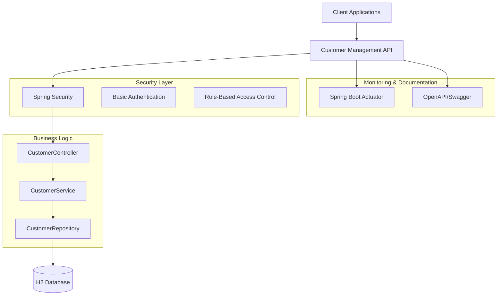
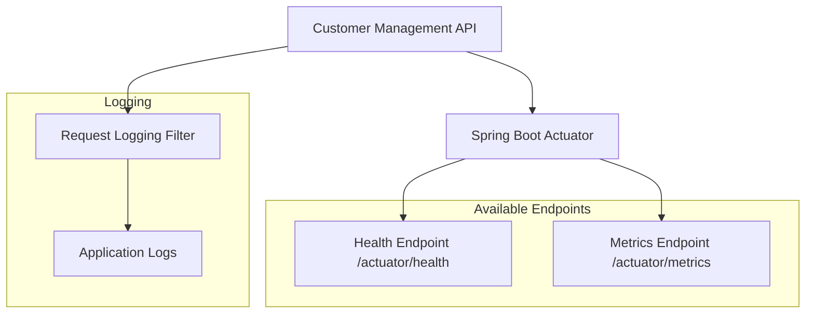

# Customer Management API Documentation

## Table of Contents

1. [Overview](#1-overview)
2. [Architecture & Design](#2-architecture--design)
   - [2.1 Architecture Overview](#21-architecture-overview)
   - [2.2 API Flow](#22-api-flow)
   - [2.3 Database Schema](#23-database-schema)
   - [2.4 Security Architecture](#24-security-architecture)
3. [API Documentation](#3-api-documentation)
4. [System Features](#4-system-features)
   - [4.1 Monitoring and Observability](#41-monitoring-and-observability)
   - [4.2 Configuration Profiles](#42-configuration-profiles)
   - [4.3 Error Handling](#43-error-handling)
5. [Getting Started](#5-getting-started)
6. [Best Practices](#6-best-practices)

## 1. Overview

The API provides a complete customer data management solution with soft deletes and comprehensive documentation. A RESTful Customer Management API built with Spring Boot 3.3.4 featuring CRUD operations, security, validation, and pagination. This project demonstrates modern Spring Boot best practices including:

- **Security**: Role-based access control with USER/ADMIN authentication
- **Monitoring**: Health checks and basic metrics
- **Documentation**: OpenAPI 3.0 with Swagger UI and comprehensive Javadoc
- **Observability**: Structured logging, request/response tracking, and correlation ID tracing
- **Production Ready**: Configuration profiles, Docker support, and audit trails

## 2. Architecture & Design

### 2.1 Architecture Overview



### 2.2 API Flow


### 2.3 Database Schema


### 2.4 Security Architecture


## 3. API Documentation

### Customer Management

| Method | Endpoint | Description | Required Role | Request Body | Response |
|--------|----------|-------------|---------------|--------------|----------|
| GET | `/api/v1/customers` | Get paginated customers | USER, ADMIN | None | CustomerPageResponseDto |
| GET | `/api/v1/customers/{id}` | Get customer by ID | USER, ADMIN | None | CustomerResponseDto |
| POST | `/api/v1/customers` | Create new customer | ADMIN | CustomerRequestDto | CustomerResponseDto |
| PUT | `/api/v1/customers/{id}` | Update customer | ADMIN | CustomerRequestDto | CustomerResponseDto |
| DELETE | `/api/v1/customers/{id}` | Soft delete customer | ADMIN | None | 200 OK |

### System Endpoints

| Method | Endpoint | Description | Access |
|--------|----------|-------------|--------|
| GET | `/api/welcome` | Welcome message | Public |
| GET | `/actuator/health` | Health check | Public |
| GET | `/actuator/info` | Application info | Public |
| GET | `/swagger-ui.html` | API documentation | ADMIN |
| GET | `/admin` | Spring Boot Admin (dev only) | ADMIN |
| GET | `/h2-console` | Database console | Public (dev only) |


## 4. System Features

### 4.1 Monitoring and Observability



### 4.2 Configuration Profiles

- **Development**: Debug logging, H2 console, Swagger UI, Admin dashboard
- **Production**: Info logging, file-based H2, no Swagger, context path `/api`
- **Test**: Minimal logging, in-memory H2, no external services

### 4.3 Error Handling


## 5. Getting Started

```bash
# Build and run the application
mvn clean package
java -jar target/interview-1.0-SNAPSHOT.jar

# Or run directly with Maven
mvn spring-boot:run
```

### Access Points
- **API**: http://localhost:8080/api/v1/customers
- **Swagger UI**: http://localhost:8080/swagger-ui.html (admin required)
- **Health Check**: http://localhost:8080/actuator/health
- **H2 Console**: http://localhost:8080/h2-console (dev only)

### Authentication
- **Admin**: `admin` / `admin` (full access)
- **User**: `user` / `password` (read-only)

## 6. Best Practices

This section details the 20 Spring Boot best practices implemented in this project, providing comprehensive explanations, importance, and verification methods.

### 1. Modern Java & Spring Boot Stack
- **Implementation**: Java 17 with Spring Boot 3.3.4 for enhanced performance and security features
- **Why Important**: Java 17 provides long-term support and modern language features, while Spring Boot 3 offers better observability
- **How to Verify**: Check `pom.xml` or run `java -version` and check application startup logs

### 2. Data Transfer Objects (DTOs)
- **Implementation**: Separate `CustomerRequestDto`, `CustomerResponseDto`, and `CustomerPageResponseDto` from the `Customer` entity
- **Why Important**: DTOs provide API stability, prevent data leakage, and allow independent evolution of API and database schemas
- **How to Verify**: Examine DTO classes in `src/main/java/com/interview/dto/` and see usage in `CustomerController`

### 3. Input Validation
- **Implementation**: Comprehensive validation using `@Valid`, `@NotBlank`, `@Email`, `@Size`, `@Min`, `@Max`, and `@Pattern` annotations
- **Why Important**: Prevents malformed data from entering the system, improves security, and provides clear error messages
- **How to Verify**: Test with invalid data via Swagger UI at `http://localhost:8080/swagger-ui.html`

### 4. Lombok Integration
- **Implementation**: Extensive use of `@Data`, `@NoArgsConstructor`, `@AllArgsConstructor`, `@RequiredArgsConstructor`, and `@Slf4j` annotations
- **Why Important**: Reduces code verbosity, minimizes human error, and improves code readability
- **How to Verify**: Check entity and DTO classes for Lombok annotations and absence of manual getters/setters

### 5. Comprehensive Logging
- **Implementation**: Structured logging with `@Slf4j` in controllers and services, including request/response logging via `RequestLoggingFilter`
- **Why Important**: Provides visibility into application behavior, aids debugging, and enables monitoring
- **How to Verify**: Check application logs during API calls or examine `RequestLoggingFilter` and service classes

### 6. Centralized Error Handling
- **Implementation**: Global exception handling using `@ControllerAdvice` and `@ExceptionHandler` in `GlobalExceptionHandler`
- **Why Important**: Ensures consistent API responses, improves user experience, and simplifies error management
- **How to Verify**: Trigger various error conditions and observe consistent error response format across all endpoints

### 7. Pagination Support
- **Implementation**: Paginated list endpoint with configurable page size, page number, sorting, and default values (page=1, pageSize=10)
- **Why Important**: Improves performance for large datasets, reduces memory usage, and provides better user experience
- **How to Verify**: Call `GET /api/v1/customers?page=1&pageSize=5` and observe pagination metadata in the response

### 8. Role-Based Authorization
- **Implementation**: Custom `@RequireAdmin` annotation and `@PreAuthorize` annotations for method-level security with USER and ADMIN roles
- **Why Important**: Ensures proper access control, protects sensitive operations, and provides fine-grained security
- **How to Verify**: Test API endpoints with different user credentials (user/password for read-only, admin/admin for full access)

### 9. Service Layer Separation
- **Implementation**: Clean separation with `CustomerService` handling business logic, `CustomerController` managing HTTP concerns, and `CustomerRepository` managing data access
- **Why Important**: Improves maintainability, testability, and follows single responsibility principle
- **How to Verify**: Examine the layered architecture in `CustomerController` → `CustomerService` → `CustomerRepository`

### 10. Data Audit Trail
- **Implementation**: `deleted` boolean field and `lastModified` timestamp field in the `Customer` entity with automatic lifecycle management
- **Why Important**: Enables data recovery, compliance tracking, and provides historical context for data changes
- **How to Verify**: Create/update customers and check the `lastModified` field in responses, or examine H2 console at `http://localhost:8080/h2-console`

### 11. Unit Testing
- **Implementation**: Comprehensive unit tests for `CustomerService` and `CustomerController` using Mockito for mocking dependencies
- **Why Important**: Ensures code reliability, catches regressions early, and improves code quality
- **How to Verify**: Run `mvn test` or examine test classes in `src/test/java/com/interview/service/` and `src/test/java/com/interview/controller/`

### 12. Integration Testing
- **Implementation**: End-to-end integration tests using `@SpringBootTest` and `MockMvc` to test complete workflows through the HTTP layer
- **Why Important**: Verifies that all components work together correctly and catches integration issues that unit tests might miss
- **How to Verify**: Run `mvn test -Dtest=CustomerIntegrationTest` or examine `CustomerIntegrationTest` class

### 13. Javadoc Documentation
- **Implementation**: Comprehensive Javadoc comments for all public methods in controllers and services
- **Why Important**: Improves code maintainability, serves as living documentation, and helps new developers understand the codebase
- **How to Verify**: Hover over method names in IDE or generate Javadoc with `mvn javadoc:javadoc`

### 14. OpenAPI Documentation
- **Implementation**: Complete OpenAPI 3.0 specification with Swagger UI integration, including detailed endpoint documentation and examples
- **Why Important**: Enables easy integration, reduces support burden, and provides interactive testing interface
- **How to Verify**: Access Swagger UI at `http://localhost:8080/swagger-ui.html` (admin credentials required)

### 15. Health Check Endpoints
- **Implementation**: Spring Boot Actuator health endpoints at `/actuator/health` providing application status and basic system metrics
- **Why Important**: Enables monitoring systems to detect application issues and provides operational visibility
- **How to Verify**: Access `http://localhost:8080/actuator/health` to see application health status

### 16. Correlation ID Tracking
- **Implementation**: `CorrelationIdFilter` generates unique correlation IDs for each request, adds them to response headers, and includes them in structured logging
- **Why Important**: Enables request tracing across distributed systems, improves debugging capabilities, and provides end-to-end visibility
- **How to Verify**: Make API calls and check response headers for `X-Correlation-ID`, or examine logs for correlation ID patterns

### 17. API Versioning
- **Implementation**: All endpoints use `/api/v1/` prefix for versioning, enabling future API evolution without breaking existing clients
- **Why Important**: Allows backward compatibility, enables gradual API evolution, and supports multiple client versions
- **How to Verify**: Check all API endpoints use `/api/v1/customers` pattern and examine `CustomerController` for versioned request mapping

### 18. Configuration Profiles
- **Implementation**: Environment-specific configurations in `application-dev.yml`, `application-prod.yml`, and `application-test.yml`
- **Why Important**: Enables environment-specific deployments, improves security by separating configs, and supports different operational requirements
- **How to Verify**: Check different YAML files for environment-specific settings and run with `--spring.profiles.active=dev|prod|test`

### 19. Docker Containerization
- **Implementation**: `Dockerfile` with Maven build process and `docker-compose.yml` for easy deployment with H2 database
- **Why Important**: Ensures consistent deployments, simplifies environment setup, and supports modern DevOps practices
- **How to Verify**: Run `docker-compose up --build` to start the containerized application at `http://localhost:8080`

### 20. Comprehensive Documentation
- **Implementation**: Detailed `documentation.md` file with Mermaid diagrams showing architecture, data flow, security model, and deployment structure
- **Why Important**: Improves project understanding, facilitates onboarding, and provides clear system overview for stakeholders
- **How to Verify**: Review this documentation file with its Mermaid diagrams and detailed explanations of system components
